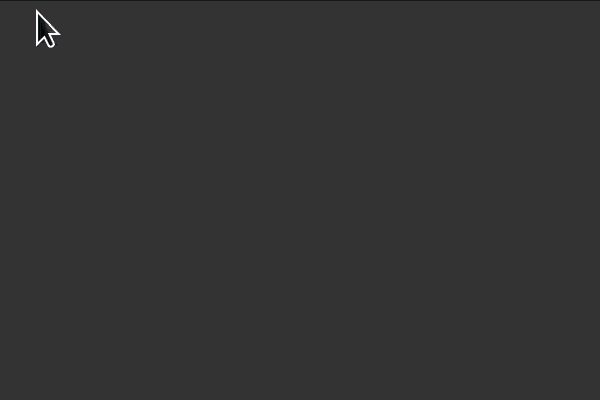

<!--**username/username** is a ✨ _special_ ✨ repository because its `README.md` (this file) appears on your GitHub profile.-->



> This animation is made with points in a Python collections.deque data structure, added by dragging the mouse (code shown bellow)
- 🔭 I'm currently working on a PhD at Unicamp.
- 🌱 I should be talking less and concentrating, but...
- 💬 Ask me about **drawing with Python**! 
    - Check out [**py5**](https://py5coding.org) and [**pyp5js**](berinhard.github.io/pyp5js/pyodide/), they bring in the vocabulary from Processing & P5js!
    - I try to make **a new drawing with code everyday**, and I put the results at  [skech-a-day](https://abav.lugaralgum.com/sketch-a-day).
- 👯 I’d like to collaborate on open resources to teach programming.
    - I collect tools **for teaching Python in a visual output** [here](https://github.com/villares/Resources-for-teaching-programming).
    - If you find the things I share here usefull, **consider supporting my work!** You can use [this PayPal donation link](https://www.paypal.com/donate/?hosted_button_id=5B4MZ78C9J724), [gumroad.com/villares](https://gumroad.com/villares), [liberapay.com/villares](https://liberapay.com/villares/), or if you are in Brazil, PIX: `46c37783-5edb-4f1c-b3a8-1309db11488c` (chave aleatória).
    - You can check out [**my Domestika course, Design with Python**](https://www.domestika.org/pt/courses/4307-design-com-python-programacao-para-um-contexto-visual/a_b_a_villares)
- 😄 Pronouns: he/him
- 📫 How to reach me: [Mastodon](ciberlandia.pt/@villares) or [Email](https://abav.lugaralgum.com/contato).
- ⚡ Fun fact: I actually use this repo to store some helper [code](https://github.com/villares/villares) I use in my drawings.

```python
from collections import deque  # a double-ended queue
import py5  # check out https://github.com/py5coding 

history = deque(maxlen=512)  # mouse dragged positions

def setup():   # py5 will call this once to set things up
    py5.size(600, 400)
    py5.no_stroke()
    py5.color_mode(py5.HSB)

def draw():   # py5 will call this in a loop
    py5.background(51)
    for i, (x, y) in enumerate(history):
        py5.fill(i / 2, 255, 255, 128)
        py5.circle(x, y, 8 + i / 16)
    if history:
        history.append(history.popleft())

def mouse_dragged():  # py5 will call this when you drag the mouse
    history.append((py5.mouse_x, py5.mouse_y))
    
def key_pressed():   # py5 will call this when a key is pressed
    history.clear()

py5.run_sketch()
```
